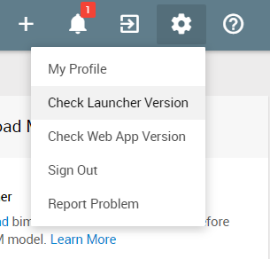

# Collaborate in a Channel

### Why Channel?

### View All Channels

### Create Channel

### Pin Channel

### Update Channel Details

### Leave Channel

### Archive Channel

### Delete Channel

There are two ways to upload your BIM models:

- **Upload from BIM Software:** Uploading from a BIM model view within authoring software gives you more control of how it looks like on bimU.io. What You See Is What You Get (WYSIWYG). Please follow the instructions in the next section to install the bimU.io Launcher before uploading a BIM model from authoring software.
- **Upload IFC files:** The industry standard IFC (Industry Foundation Classes) format is also supported. Most authoring software can export to an IFC file. You can then upload it to bimU.io directly. 

### Install bimU.io Launcher

!!! warning "Note that you must have bimU.io Launcher installed to upload a model from BIM software."

#### What is bimU.io Launcher?

bimU.io Launcher is a middleware that exchanges data between bimU.io and BIM software. It is a background process running along with BIM software without a user interface. Unlike other third-party tools that require a plugin opened manually within various BIM software for exporting data, bimU.io Launcher implements the so-called **Pluginless** technology which allows users to stick with a single user interface, i.e., using bimU.io via browser.

#### Supported BIM Software

- Autodesk Revit 2014-2021
- Autodesk Navisworks 2014-2021
- Trimble Tekla Structures 21.0-2020
- Solibri 9.12.1 (Open viewpoint only)

#### Download Installer

**<a href="https://github.com/Transformosa/bimU.io.Launcher/releases/download/2021.2.8.0/bimU_io_Launcher_2021.2.8.0.exe" target="_blank">Download bimU.io Launcher 2021.2.8.0</a>**

!!! warning "Please close all BIM software sessions prior to installation."

The latest version of bimU.io Launcher is 2021.2.8.0. The installer can downloaded from the link above. Technically speaking, admin right is NOT required for the installation. Please speak to your IT staffs if you don't have permission to install it.

#### Automatic Update

bimU.io Launcher performs automatic update behind the scene for the installed components. However, you will need to download a new installer for a new version of BIM software. For example, bimU.io Launcher can update itself for Autodesk software 2014-2021 whenever bimU.io has a new release or a bug fixed. But a new installer will be required to support Autodesk software 2022 next year.

{: class="center" style="width:40%"}

You can check out the installed version fo bimU.io Launcher from the top menu bar. For an automatic update to take effect immediately, we suggest repeat the following steps **twice**: 

1. Restart your machine or log off Windows.

2. Make sure you have a stable internet connection.

3. Open any supported BIM software.

4. Open any file and wait for one minute.

#### Troubleshooting

If you have any problem installing or using bimU.io Launcher, please log a support ticket with the following two items attached if they exist:

- **Log File:** Open Windows File Explorer and paste `%localappdata%\temp\bimU.io.log` in the address bar. The log file is stored as `launcher.log` in the folder.
- **Error Code:** An error code, such as `No BIM software is currently opened. Error code: 1002`, would be shown in browser when something goes wrong on bimU.io.