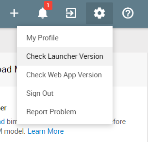

# Get Started with bimU.io Agile
This is a quick start guide to walk you through some basic functionality on bimU.io Agile.

### Log in to bimU.io Agile
Single Sign-On (SSO) is enforced on bimU.io Agile. Every user needs to have a **Microsoft** or **Google** account to log in. It can be a company, school, organisation, or personal account. Simply go to **<a href="https://agile.bimu.io" target="_blank">bimU.io Agile</a>** and select preferred login method to continue.

{: class="center" style="width:80%"}

If you're a first-time user, make sure your profile is correct before creating a bimU.io Agile account.

{: class="center" style="width:80%"}

### Welcome Information
You'll see a welcome screen if you don't have any active channel. Try to install **<a href="/" target="_blank">bimU.io Launcher</a>** if you want to upload models from BIM software. Documentation is also available.

{: class="center" style="width:80%"}

### Create New Channel
**Channel** is a workspace for team collaboration where BIM models and issues are stored. Click the `CREATE MY FIRST CHANNEL` button to create a new channel. Make sure ``Create channel with sample data`` is ticked if you'd like to view sample issues and sample models.

{: class="center" style="width:80%"}

Once a channel is created, you'll see an issue list view by default. The navigation menu on the left-hand side is specific to this channel.

{: class="center" style="width:80%"}

There are also some quick actions available on the top menu bar.

{: class="center" style="width:80%"}

### Invite Your Team Members
Now it's time to add your project team members to this channel. Click the ``+`` button on the top menu and select ``Add Member``. You can then send invites to multiple email addresses. Your team members can join the channel from a unique link in the email. They'll be logging in to bimU.io Agile in the same way.

{: class="center" style="width:80%"}

### Create New Issue
**Issue** is normally a problem found in BIM models that you want to capture and track. Click the ``CREATE ISSUE`` button on the left menu to create a new issue. If you already have **bimU.io Launcher** installed and supported BIM software opened, it is possible to capture a snapshot of the active 3D view and its camera viewpoint. Fill in relevant issue information and then click ``Create``.

{: class="center" style="width:80%"}

## Kanban Board
You can review issues on the **<a href="https://en.wikipedia.org/wiki/Kanban_board" target="_blank">Kanban board</a>** that visually categorises issues in vertical columns. Drag an issue card and put it into another column to push it forward.

{: class="center" style="width:80%"}

Click on an issue card to see its details.

{: class="center" style="width:80%"}

Moreover, you can open a saved viewpoint in BIM software or in bimU.io Agile's online model viewer.

{: class="center" style="width:80%"}

### Navigate BIM Models
Click the ``UPLOAD MODEL`` button on the left menu to upload an IFC file or export a model view from BIM software. Once uploaded, it will show up on the ``Models`` page.

{: class="center" style="width:80%"}

Select a model file to open up the web viewer. 3D navigation tools are available on the toolbar. Element properties, model metadata, etc. can be viewed from the right panels.

{: class="center" style="width:80%"}

### Issues and Web Viewer
You can also create or view issues directly from bimU.io's web viewer. If a BIM model is opened in the web viewer, a snapshot of the current view as well as its camera viewpoint will automatically be captured when you create an issue. There's also an ``Issues`` panel on the right-hand side that allows you to view issues side by side and open viewpoints more quickly. 

{: class="center" style="width:80%"}

### Personal Dashboard
Personal dashboard is bimU.io Agile's landing page. It puts together some updates, including pinned channels, recently viewed issues, recently uploaded models, issues assigned, issues due, etc.

{: class="center" style="width:80%"}

### Personal Profile
Make your profile complete allows your collaborators to know your project or business role. Open your profile from the top right avatar, then you can change your name, company, and job title. 

{: class="center" style="width:80%"}