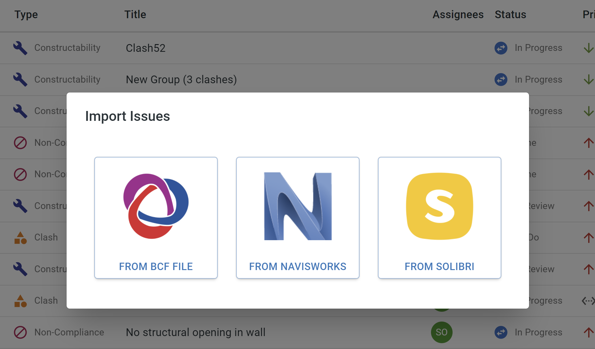
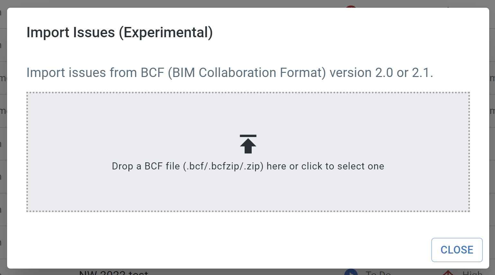
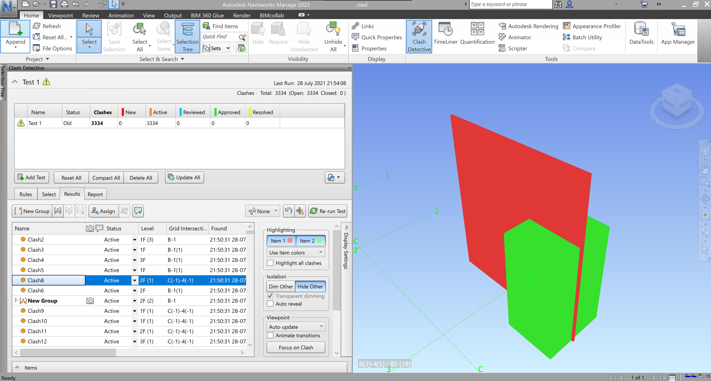
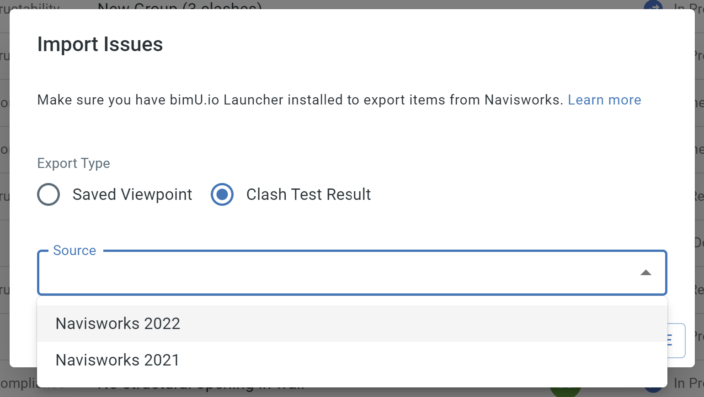
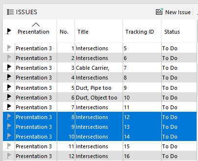
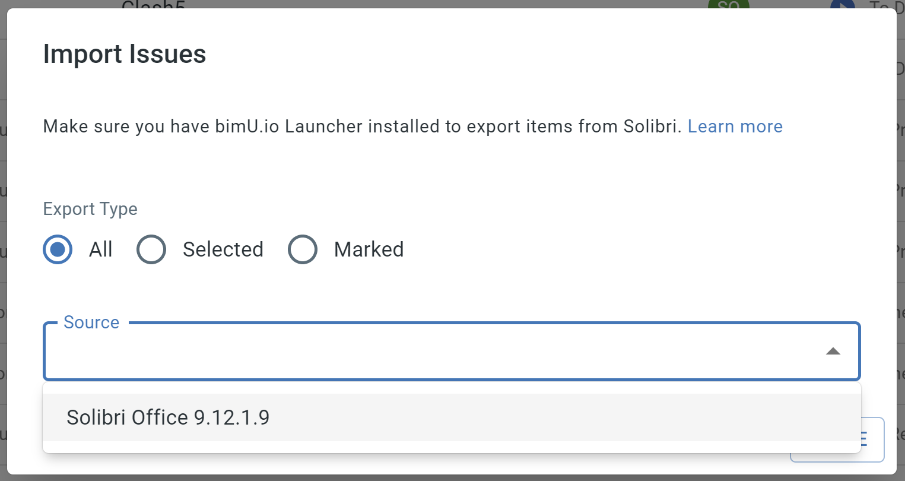
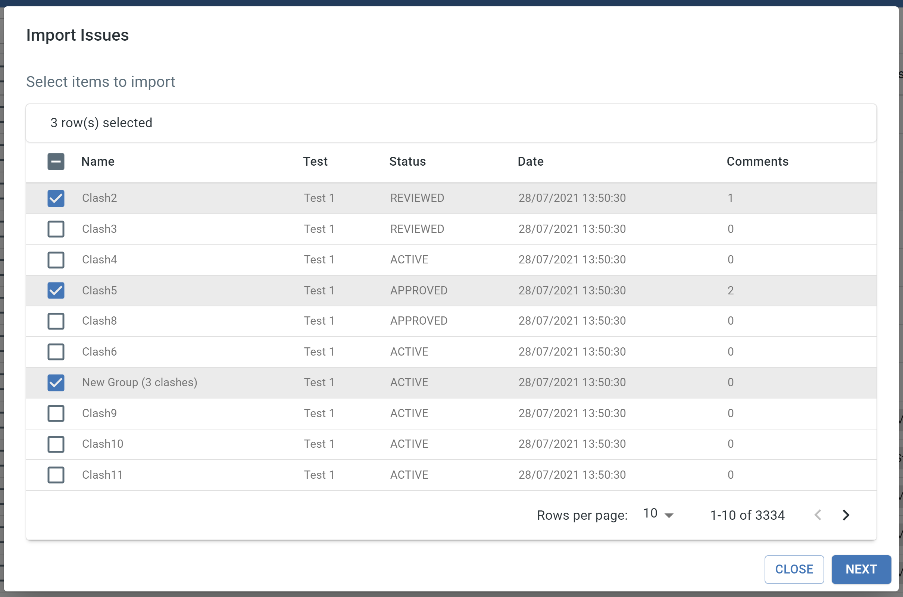
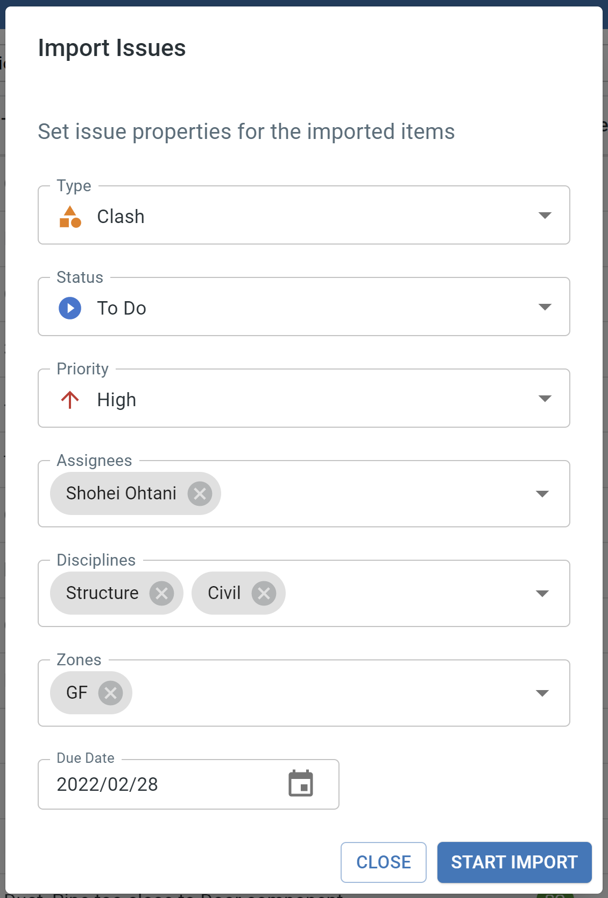
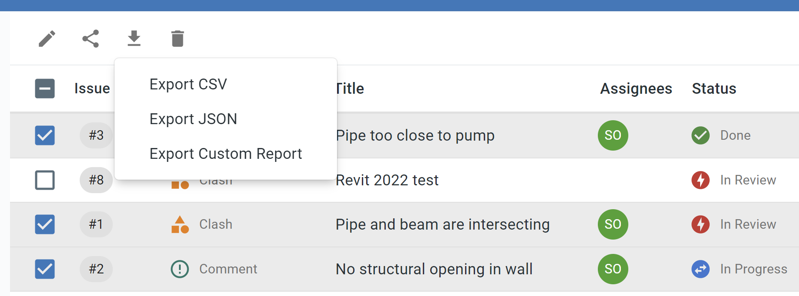
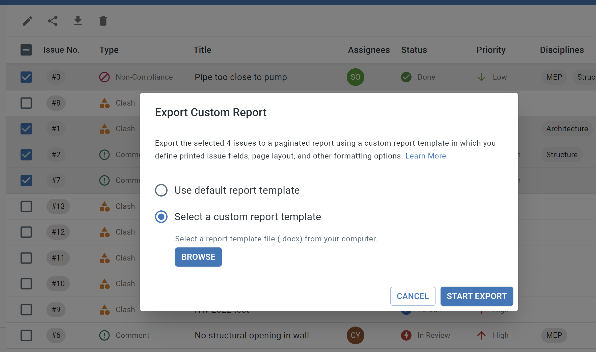

# Import and Export Issues
Occasionally you might want to bulk import or export issues for various purposes. bimU.io Agile provides a number of different ways to do it.

### Import Issues
If you run clash detection or capture problems in other BIM software, it is possible to import issues in batch to bimU.io Agile. Click the ``plus`` button on the top right menu bar and select ``Import Issues``. Then you can select which source to import issues from.

{: class="center" style="width:80%"}

#### Import from BCF
<a href="https://en.wikipedia.org/wiki/BIM_Collaboration_Format" target="_blank">BIM Collaboration Format (BCF)</a> is a structured file format suited to issue tracking with a building information model. bimU.io Agile supports BCF version 2.1 (recommended) or 2.0 (.bcf/.bcfzip/.zip).

{: class="center" style="width:80%"}

#### Import from Navisworks
There are two types of saved items in Navisworks: `Clash Detective` and `Saved Viewpoint`. Choose one to import. 

{: class="center" style="width:80%"}

Make sure you have the latest [bimU.io Launcher](/upload-a-bim-model#install-bimuio-launcher) installed and select a Navisworks session from the list to proceed to [Select Items](/agile/import-and-export-issues#select-items-to-import).

{: class="center" style="width:80%"}

#### Import from Solibri
Please firstly make sure Solibri is opened with REST API enabled and [bimU.io Launcher](/upload-a-bim-model#install-bimuio-launcher) is running in the background. We've created a Windows program called **Start Solibri** that does everything needed to use this function. You can find it in the `Start Menu` => `bimU.io` (or `Transformosa`) => `Start Solibri`.

By default, it will import all of the issues in the current `Presentation`. Alternatively, you can `select` or `mark` some issues to import.

{: class="center" style="width:60%"}

Make sure you have the latest [bimU.io Launcher](/upload-a-bim-model#install-bimuio-launcher) installed and select a Solibri session from the list to proceed to [Select Items](/agile/import-and-export-issues#select-items-to-import).

{: class="center" style="width:80%"}

#### Select Items to Import
Review and select what items to import. The table has a few tools, such as text search, filter, etc., that allow you to quickly find issues. Click `NEXT` to [Set Issue Properties](/agile/import-and-export-issues#set-issue-properties) when you're done. 

{: class="center" style="width:80%"}

#### Set Issue Properties
You can set issue properties to apply to the selected items. Click `START IMPORT` to trigger the import process.

{: class="center" style="width:60%"}

### Export Issues
You can export selected issues from the [Issue List](/agile/manage-and-resolve-issues/#view-issues-in-issue-list) to different formats, including JSON, CSV, and your custom report format.

{: class="center" style="width:80%"}

#### Export to JSON
JSON format saves issue data in its original form which is easier to be analysed programmatically.

#### Export to CSV
CSV format is useful for data analytics. For example, you can import it into Power BI to create metrics and graphs.

#### Export to Custom Report
Sometimes you might need to prepare paper-based issue report. bimU.io Agile supports user-defined custom report in Microsoft Word format. You can insert issue field placeholders in a DOCX file that can subsequently be populated by actual values of selected issues.

{: class="center" style="width:80%"}

We provide a default report template which you can further modify to define printed issue fields, page layout, and other formatting options. 

<a href="/files/default-report-template.docx" target="_blank">Download Default Report Template</a>

Issue field placeholders must be wrapped between ``FOR`` and ``END-FOR`` as below.

```
+++FOR issue IN issues+++

Issue field placeholders you need should be put here...

+++END-FOR issue+++
```

Below is a list of supported issue fields:

| Issue Field | Placeholder Example                                                                                                       |
|-------------|---------------------------------------------------------------------------------------------------------------------------|
| title       | +++INS $issue.title+++                                                                                                    |
| description | +++INS $issue.description+++                                                                                              |
| id          | +++INS $issue.id+++                                                                                                       |
| number      | +++INS $issue.number+++                                                                                                   |
| type        | +++INS $issue.type+++                                                                                                     |
| status      | +++INS $issue.status+++                                                                                                   |
| priority    | +++INS $issue.priority+++                                                                                                 |
| disciplines | +++FOR discipline IN $issue.disciplines+++<br>+++INS $discipline+++<br>+++END-FOR discipline+++                           |
| zones       | +++FOR zone IN $issue.zones+++<br>+++INS $zone+++<br>+++END-FOR zone+++                                                   |
| creator     | +++INS $issue.creator.name+++                                                                                             |
| assignees   | +++FOR assignee IN $issue.assignees+++<br>+++INS $assignee.name+++<br>+++END-FOR assignee+++                              |
| comments    | +++FOR comment IN $issue.comments+++<br>+++INS $comment.creator.name+++: +++INS $comment.text+++<br>+++END-FOR comment+++ |
| markup      | See below HTML example                                                                                                    |
| dueDate     | +++INS $issue.dueDateFormatted+++                                                                                         |
| created     | +++INS $issue.createdFormatted+++                                                                                         |
| updated     | +++INS $issue.updatedFormatted+++                                                                                         |
| attached images     | +++FOR imageUrl IN $issue.imageUrls+++<br>+++ IMAGE imageData($imageUrl, 1.6, 4)+++<br>+++END-FOR imageUrl+++                                                                                        |

HTML syntax can be used to render markup image in your custom report. Here is an example:

```html
+++HTML `
<meta charset="UTF-8">
<body>

</body>
`+++
```
