# ISO 19650 Compliant Document Storage
bimU.io Agile supports ISO 19650 compliant document management by using Microsoft SharePoint or Microsoft Teams as Common Data Environment (CDE). Read <a href="https://bit.ly/bimu-cde" target="_blank">our blog post</a> for an introductory chapter.

#### Log in with Your Microsoft Account
You need to have an active Microsoft 365 (formerly Office 365) licence that can access Microsoft SharePoint or Microsoft Teams.

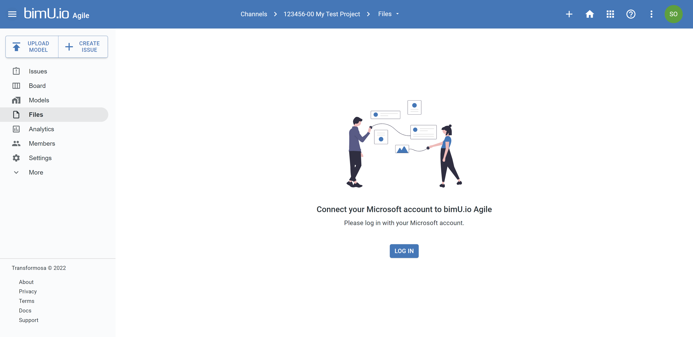{: class="center" style="width:100%"}

#### Connect with Document Library
Select an existing SharePoint site and then select a document library.

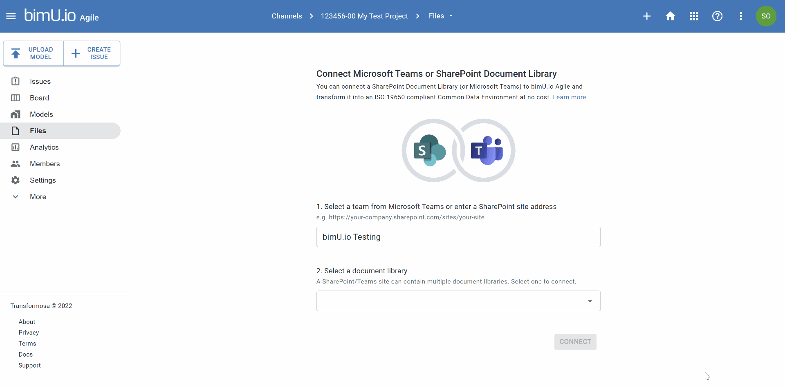{: class="center" style="width:100%"}

#### Create Folder Structure
Once the live connection is set up, it shows SharePoint root folder. You can continue to set up a ISO 19650 compliant folder structure.

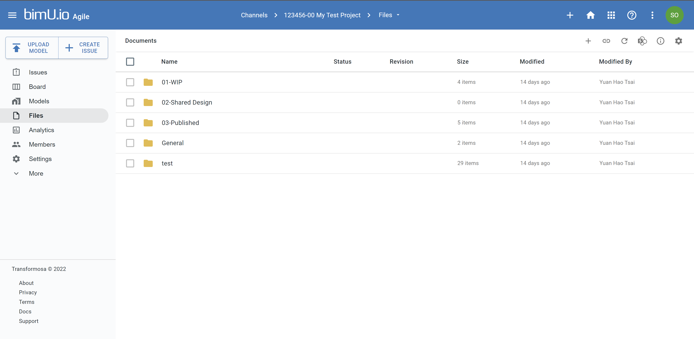{: class="center" style="width:100%"}

#### Explore Files
File explorer interface is similar to SharePoint.

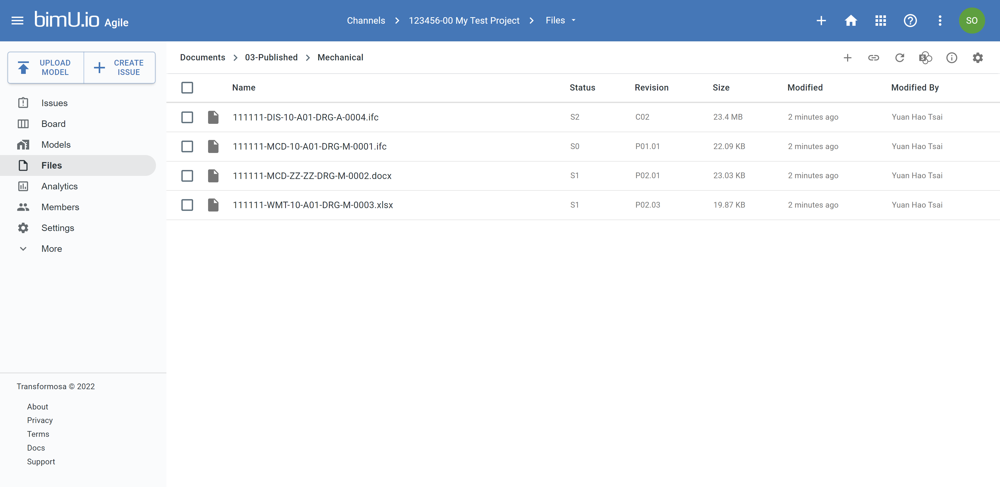{: class="center" style="width:100%"}

#### Manage Files
Click the three dot button. You can use file specific functions as in SharePoint.

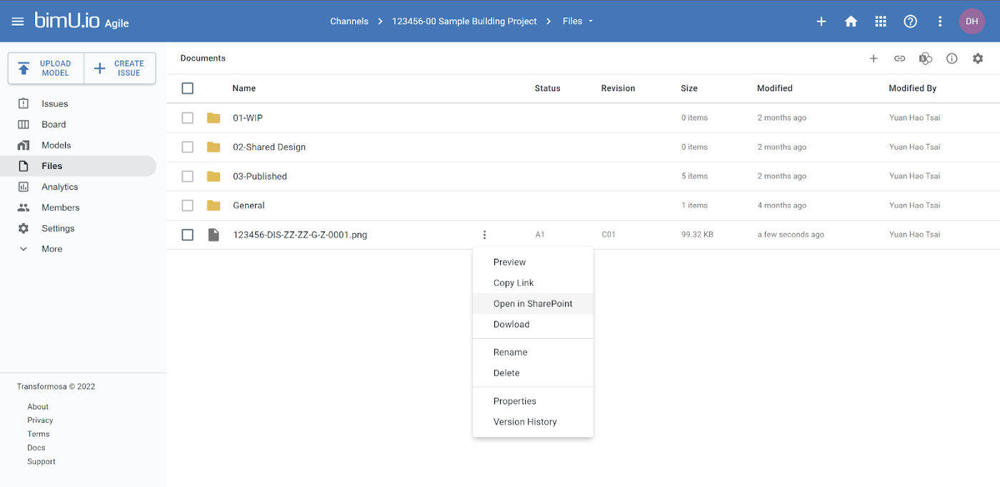{: class="center" style="width:100%"}

#### Configure Naming Standard
You'll be prompted to set up a naming standard when a document library is first connected. Or you can also re-configure it from the gear button menu.

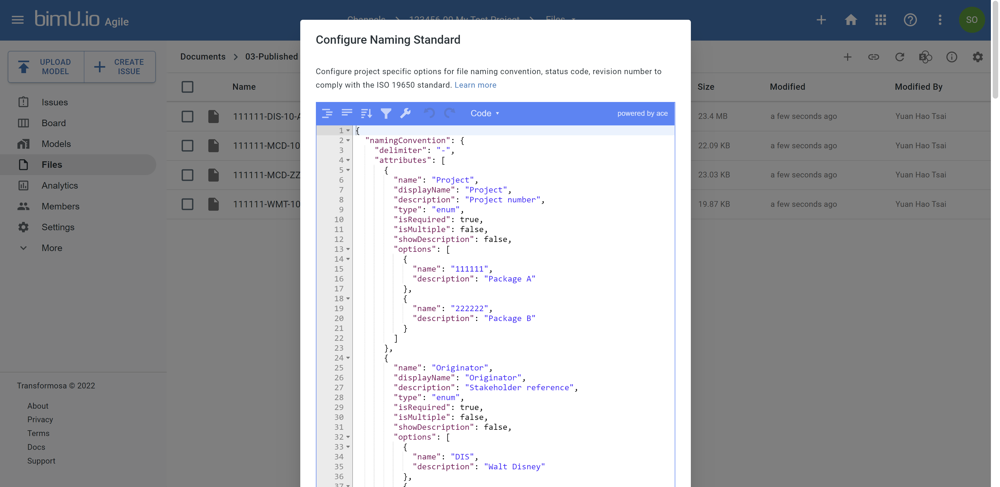{: class="center" style="width:100%"}

#### Configure SharePoint Columns
Go to SharePoint to add two necessary columns `Status` and `Revision` so that bimU.io can automatically populate relevant information. The column name has to be consistent with your naming standard configuration.

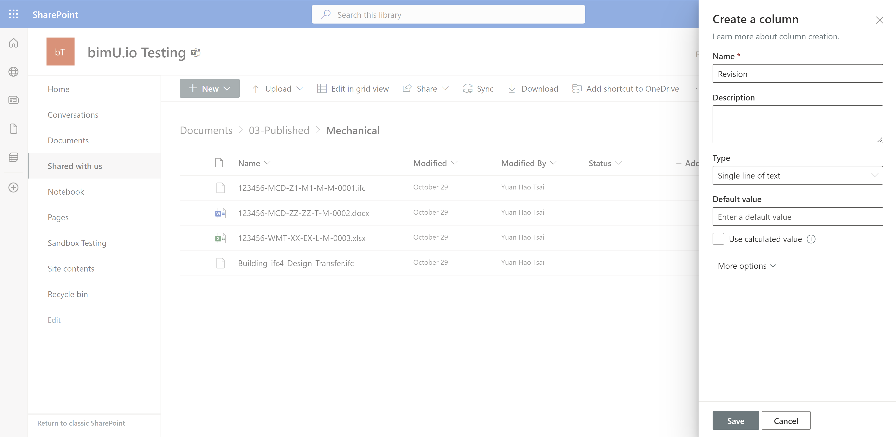{: class="center" style="width:100%"}

#### Upload Files and Populate Document Attributes
To upload files to SharePoint through bimU.io Agile, drag and drop files into the interface or click the plus button. Once uploaded, you'll be prompted to populate document attributes based on your naming standard.

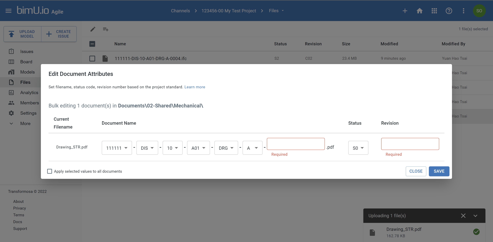{: class="center" style="width:100%"}

#### Bulk Update Document Attributes
When multiple files are selected, it is possible to bulk update document attributes. When the `Apply selected values to all documents` option is ticked, every selected attribute option is applied to all documents.

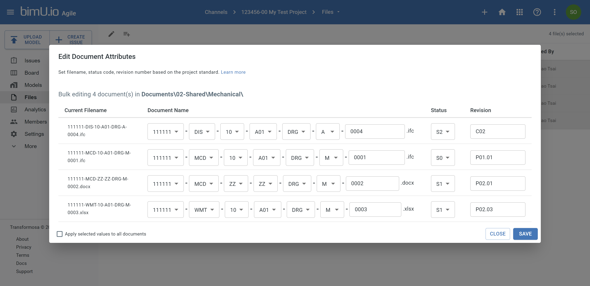{: class="center" style="width:100%"}

#### Document Attribute Options
Document attribute options can be added, edited, or deleted from your naming standard.

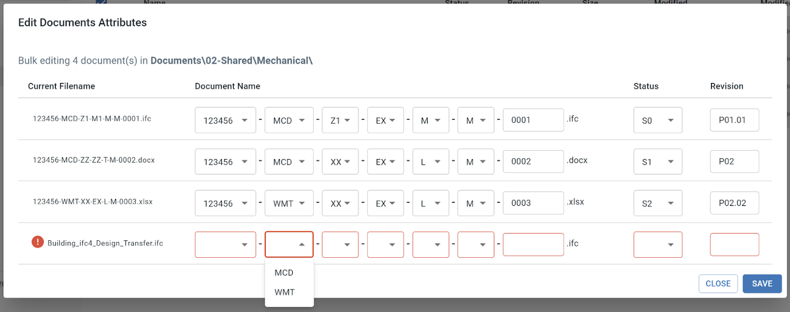{: class="center" style="width:100%"}

#### Increment Revision Numbers
When multiple files are selected, bimU.io Agile can bulk increment revision numbers for all selected documents.

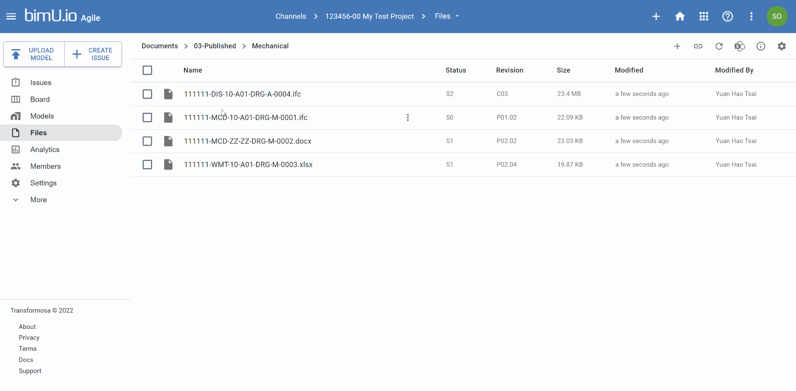{: class="center" style="width:100%"}

#### Open in SharePoint
The SharePoint interface should display the same attribute information as in bimU.io Agile.

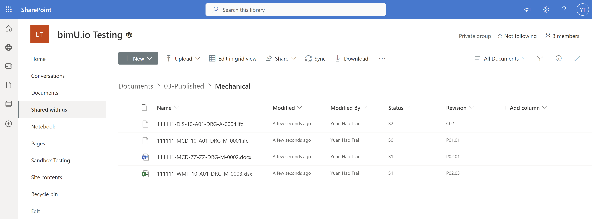{: class="center" style="width:100%"}

#### Upload BIM Model to SharePoint
When uploading a BIM model, it is possible to save a shortcut to the BIM model in the current SharePoint folder.

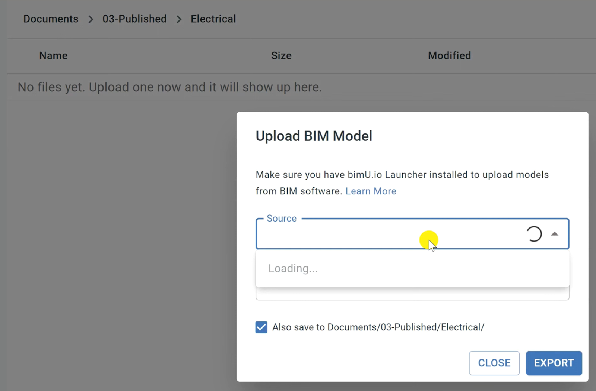{: class="center" style="width:100%"}

#### Other Options
Click the gear button if you want to log out, disconnect document library, or configure naming standard.

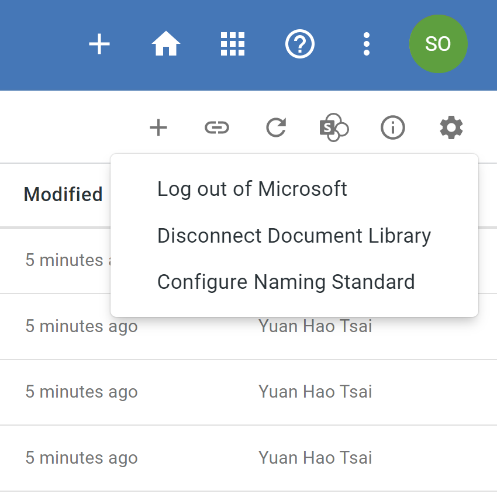{: class="center" style="width:60%"}

