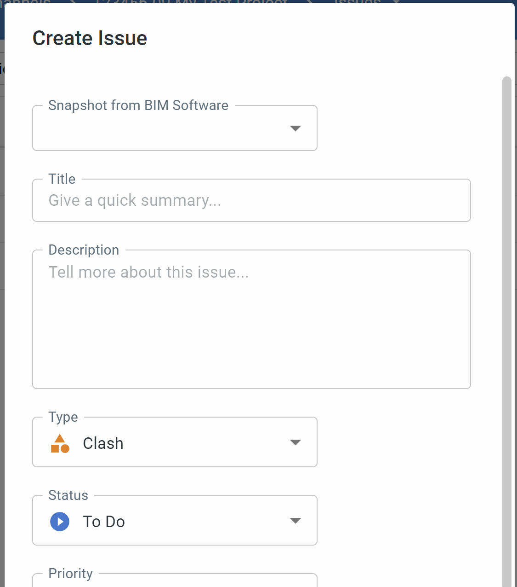
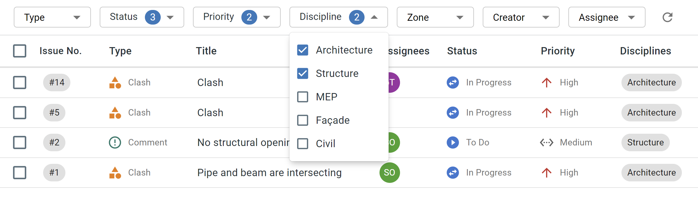

# Manage and Resolve Issues
bimU.io Agile has a comprehensive issue tracking capability for recording and managing problems or tasks in BIM models. An issue can be anything from an interdisciplinary clash to a constructability problem. You can also add **Markup** to a BIM **Snapshot** with a saved **Viewpoint** while creating a new issue. Subsequently, you can review issues and open corresponding camera viewpoints within multiple BIM environments, including BIM modelling tools, BIM clash detection tools, and bimU.io Agile's online model viewer.

### Create Issue
Click the ``CREATE ISSUE`` button on the left menu to create a new issue. Alternatively, you can do it from the plus button in the top menu bar.

{: class="center" style="width:60%"}

#### BIM Snapshot
Having a BIM snapshot attached to an issue is helpful to review from the same viewpoint later on. bimU.io Agile can navigate you to the same location in 3D environment. There are two ways to add a snapshot of the active BIM model view along with its camera viewpoint:

- **Add snapshot from BIM Software:** 
Make sure you have [bimU.io Launcher](/upload-a-bim-model#install-bimuio-launcher) installed and have supported BIM software opened. The ``Snapshot from BIM Software`` dropdown will show a list of available BIM software for you to select. If you'd like to track down some model elements, remember to select them in the active view.

!!! info "Having section box enabled and clipped to a small range makes the camera viewpoint saved more precisely."

{: class="center" style="width:60%"}

- **Add snapshot from Web Viewer:**
Open a BIM model in bimU.io Agile's web viewer and then try to create a new issue. A snapshot of the current view should automatically be added.

{: class="center" style="width:80%"}

#### Markup Tool
You can add markup to a snapshot to provide more context. The markup tool allows you to create lines, shapes, texts, etc. to annotate model view. Click the edit button to open the markup tool. If you want to start over, click the delete button.

{: class="center" style="width:80%"}

#### Camera View and Attached Elements
If a snapsoht is created from BIM software, camera view type and number of selected elements will be shown on the bottom. This information will be useful when you open a viewpoint later.

{: class="center" style="width:60%"}

#### Issue Fields
Every issue has a number of issue fields associated with it, including ``title``, ``description``, ``type``, ``status``, ``priority``, ``assignees``, ``disciplines``, ``zones``, ``due date``, etc. These issue fields are configurable. You can change available options based on project requirements. See [Configure Issue Fields](/agile/configure-issue-fields) for more information.

{: class="center" style="width:50%"}

#### Create Issues with Similar Settings
Occasionally you might want to create issues consecutively with the same issue type, disciplines, zones, etc. Tick the ``Create another`` check box. Then you can create another issue with the same options selected.

{: class="center" style="width:60%"}

### View Issues in Issue List
Go to the ``Issues`` page to view all issues in a table. You can turn on/off table columns from the toolbar.

{: class="center" style="width:80%"}

### View Issues on Kanban Board
Go to the ``Board`` page to view all issues on a <a href="https://en.wikipedia.org/wiki/Kanban_board" target="_blank">Kanban</a> board. Every issue is represented in a card and categorised in different columns by issue statuses. You can change row grouping, column grouping, and display order from the toolbar. If you drag and drop an issue card into a different column or row, the issue fields will also change accordingly.

{: class="center" style="width:80%"}

### View Issues alongside Web Viewer
Open a BIM model in bimU.io Agile's web viewer and click the ``Issues`` icon button on the right toolbar. All issues will show up on an ``Issues`` panel. You can quickly open a saved viewpoint in the web viewer from an issue card.

{: class="center" style="width:80%"}

### Issue Filters
You can find issues more quickly with certain conditions, i.e. an issue field has specific values. Issue filters are available on the ``Issues`` page, the ``Board`` page, and the ``Issues`` panel. Click the reset button to clear all filters.

{: class="center" style="width:80%"}

### View and Update Issue Details
Clicking an issue on either a table row or a card will open up a dialog that shows issue details. Every channel member can update issue fields and leave comments here. Click on the image to view markup and snapshot in its original size.

{: class="center" style="width:80%"}

### Open Viewpoint
Saved viewpoint can be opened in supported BIM software or in bimU.io Agile's web viewer. Click the magnifier button and select where you want the viewpoint to be opened. Before opening a viewpoint, you **must** also open the original BIM model file or an identical BIM model. The underlying principle is similar to <a href="https://github.com/BuildingSMART/BCF-XML/tree/master/Documentation#visualization-information-bcfv-file" target="_blank">BCF (BIM Collaboration Format) viewpoint</a>.

{: class="center" style="width:50%"}

#### Open Viewpoint in BIM Software
Again, make sure you have [bimU.io Launcher](/upload-a-bim-model#install-bimuio-launcher) installed and have supported BIM software opened. If the current viewpoint has attached elements, i.e. some elements were selected during issue creation, you can select and/or isolate attached elements to find them more easily in the active model view.

!!! info "A perspective viewpoint will be opened as a camera view in Autodesk Revit which is a bit clunky to navigate. Use orthographic view to create an issue if you're going to review it in Revit."

#### Open Viewpoint in Web Viewer
If you have the ``Issues`` panel opened alongside the web viewer, simply click the magnifier button on an issue card to open viewpoint. If you have the web viewer opened in another browswer window, you can open viewpoint from the issue details dialog. This is particularly useful when you have multiple monitors. For example, you can use the Kanban board and the web viewer at the same time by putting them on different screens.

### Move Issues Forward
Every issue should be progressively closed out based on the sequence of issue statuses. You can find more information [here](/agile/configure-issue-fields#status). If you have issues grouped by status in board columns, it's the easiest way to move issues to the next status column by drag-and-drop. Alternatively, you can change issue status in the issue details dialog.

{: class="center" style="width:80%"}
 
### Delete Issue
You can delete issues that were created by youself. Only a channel admin has permission to delete every issue. To delete an issue, click the three dot button on the top right in the issue details dialog and select ``Delete``.