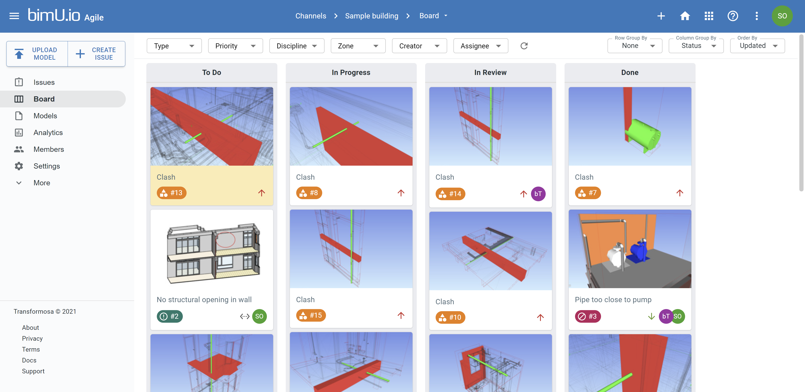
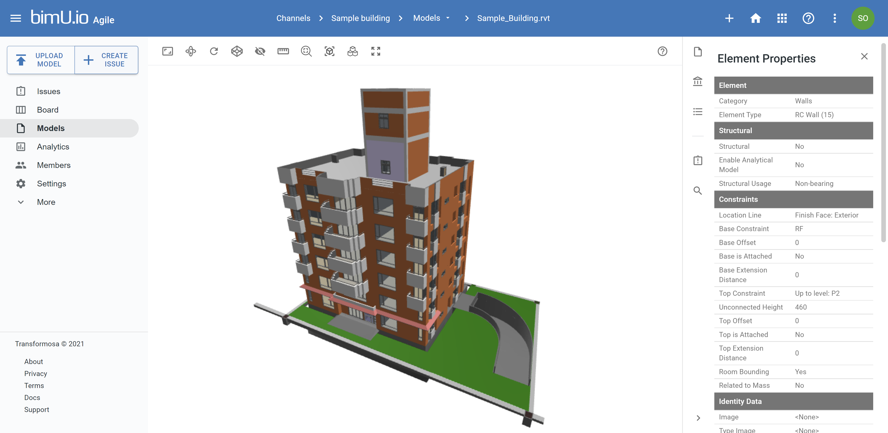
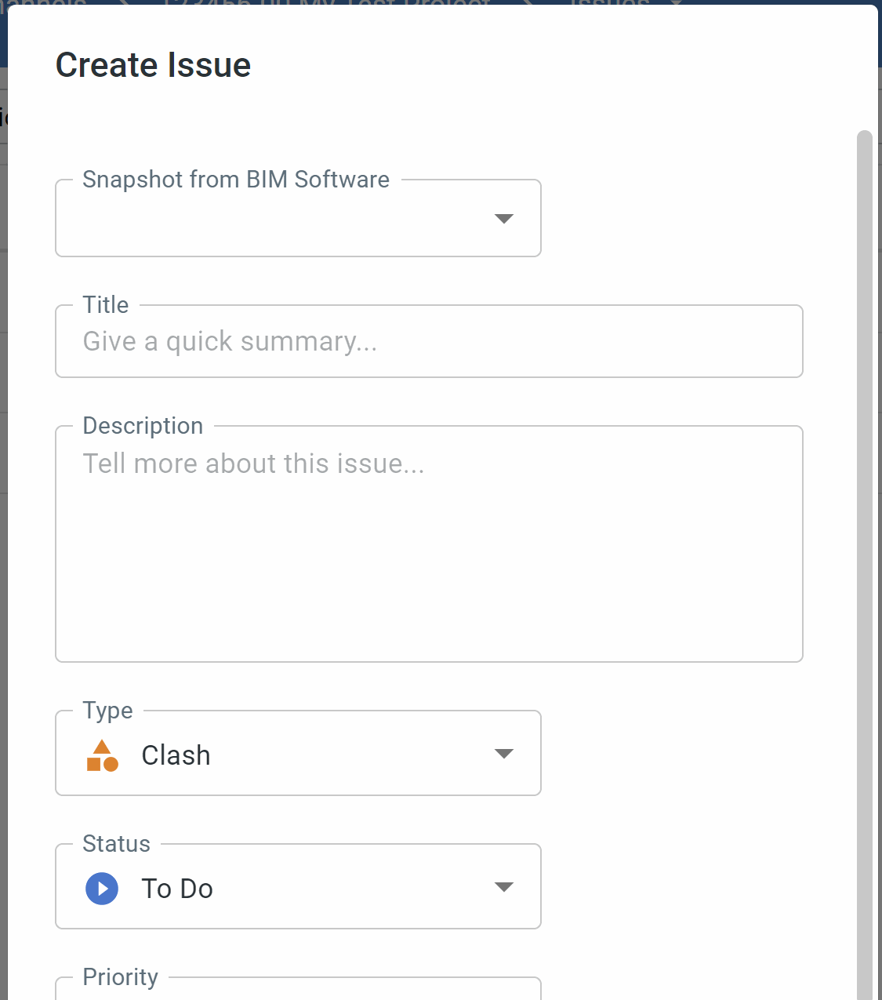
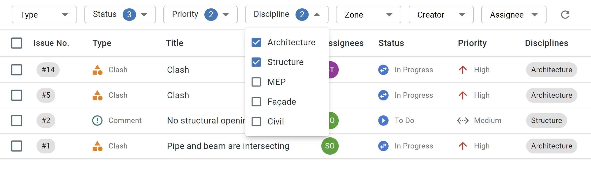

# bimU.io Agile Overview
bimU.io Agile is a Cloud-based BIM issue tracking platform that aims to streamline the traditional design review process using the prominent Agile management methodology. Working in a team environment called **Channel**, BIM managers, drafters, designers, and engineers can work together to track down and close out design issues in BIM models. This gives project team better visibility to "who is responsible for what and by when". Issues can be assigned to project team members who can interrogate BIM models in preferred BIM software as well as using bimU.io's full-fledged online model viewer. With the cutting-edge **Pluginless** technology, users can instantly create markups and open saved viewpoints across multiple BIM environments to resolve issues iteratively for more effective multi-disciplinary coordination and communication.

### Agile BIM Issue Tracker
BIM issues are captured within a centrally managed database and can be visualised on a Kanban board or in a task list. Every team member can view issue details, comment on issues, and move issues forward. Issue fields are fully configurable to suit project requirements. You can define project specific issue types, statuses, priorities, disciplines, zones, etc.

{: class="center" style="width:80%"}

### Data-driven BIM Platform
bimU.io Agile is built upon bimU.io's fully functional, high-performance web viewer that provides smooth user experience while navigating large-scale BIM models. Every BIM model uploaded to the bimU.io platform is backed by an underlying database that enables real-time BIM data query and data wrangling on the fly.

{: class="center" style="width:80%"}

### "Pluginless" Integration
bimU.io Agile works with most of the prevailing BIM authoring tools, including Autodesk Revit, Autodesk Navisworks, Trimble Tekla Structures, Solibri Model Checker, etc. You can upload models and create issues from supported BIM software and subsequently review them across multiple BIM environments without leaving bimU.io's browser user interface thanks to the cutting-edge Pluginess technology.

{: class="center" style="width:60%"}

### Cloud-based Collaboration
bimU.io Agile is fully managed and hosted in the Cloud. This opens the door to seamless integration with other Cloud-based project systems, such as Microsoft Teams, SharePoint, etc. Project issues and BIM models are stored in a secure Cloud environment and only accessible to authorised team members. Single Sign-On is enabled by default which requires your respective company or oransiational account to log in via Microsoft or Google identity systems.

{: class="center" style="width:80%"}

### Project-based Pricing
We fully understand the challenge of software procurement and expense recharge, especially when it comes to collaboration with external parties. bimU.io Agile is a SaaS (Software as a Service) offering that doesn't require IT infrastructure provision. Our project-based licencing model charges a flat rate per team environment (i.e. Channel) set up on bimU.io Agile rather than per-user. At the same price, you can add as many users as needed (including users in external organisations), upload unlimited BIM models, create unlimited issues, etc. No upfront cost. No tenancy management required.

### Video Podcast

We are constantly adding short clips to the playlist below to demonstrate the functionality of bimU.io Agile. Stay tuned on our our social media (<a href="https://twitter.com/TransformosaUK" target="_blank">Twitter</a>, <a href="https://www.facebook.com/transformosa" target="_blank">Facebook</a>, <a href="https://www.youtube.com/channel/UCW4NVA53RqJUfjJe3gao1kA" target="_blank">YouTube</a>, <a href="https://medium.com/transformosa-blog" target="_blank">Blog</a>) for the updates.

<iframe class="center" width="560" height="315" src="https://www.youtube.com/embed/videoseries?list=PLBL8gXaMel0fzV9YVMq_kJ3VLHiaa7whO&amp;controls=1&amp;showinfo=1" frameborder="0" allow="accelerometer; autoplay; encrypted-media; gyroscope; picture-in-picture" allowfullscreen></iframe>

### User Support

<a href="https://support.bimu.io" target="_blank">bimU.io Support Centre</a> provides different types of help: 

- **FAQ:** You can find a list of Frequently Asked Questions (FAQ) and answers.
- **Community Forum:** Participate in discussion and look for advice in our community forum.
- **Service Desk:** Please report a problem by logging a support ticket. Our customer service representatives will be in touch.