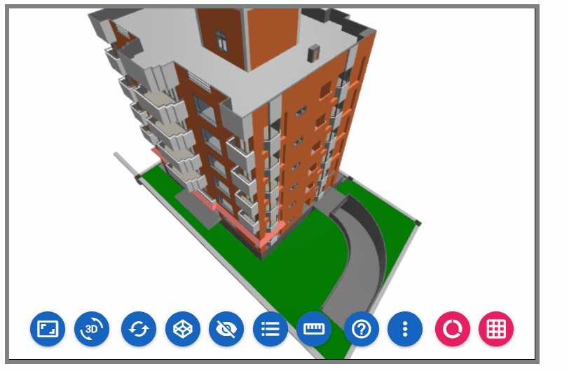
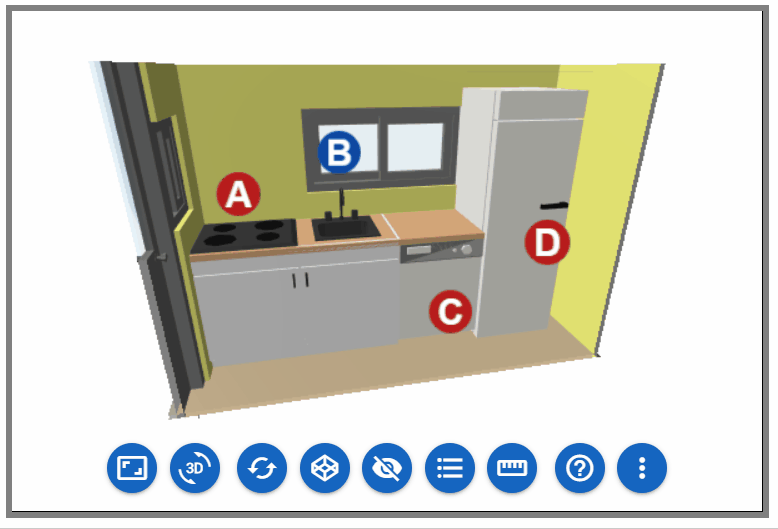

# Examples

### Save and Restore Viewpoint
This example saves BCF viewpoint and screenshot temporarily. Clicking on a screenshot will restore a previously saved viewpoint.

{: class="center" style="width:60%"}

<iframe width="100%" height="550" src="//jsfiddle.net/8r2gk37s/embedded/" allowfullscreen="allowfullscreen" allowpaymentrequest frameborder="0"></iframe>

### Highlight Walls by Floor
This example finds all wall elements on a selected floor by database query and then changes wall color to red.

{: class="center" style="width:60%"}

<iframe width="100%" height="500" src="//jsfiddle.net/jgydoLx7/embedded/" allowfullscreen="allowfullscreen" allowpaymentrequest frameborder="0"></iframe>

### Calculate Total Perimeter and Area
This example calculates total perimeter and area of selected floor elements by aggregation query.

{: class="center" style="width:60%"}

<iframe width="100%" height="500" src="//jsfiddle.net/Lqzvf2sh/embedded/" allowfullscreen="allowfullscreen" allowpaymentrequest frameborder="0"></iframe>

### Create Coloured 3D Zones
This example finds all floor elements on a selected floor and creates extrusions in different colours.

{: class="center" style="width:60%"}

<iframe width="100%" height="500" src="//jsfiddle.net/pfkgz431/embedded/" allowfullscreen="allowfullscreen" allowpaymentrequest frameborder="0"></iframe>

### Asset Tagging
This example calculates bounding boxes of kitchen equipments and places custom tags for them.

{: class="center" style="width:60%"}

<iframe width="100%" height="500" src="//jsfiddle.net/vydpe5sw/embedded/" allowfullscreen="allowfullscreen" allowpaymentrequest frameborder="0"></iframe>