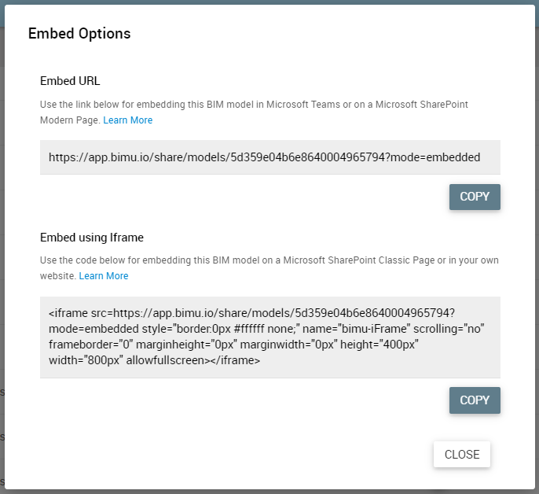
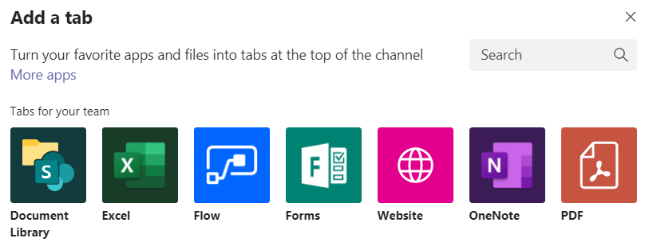
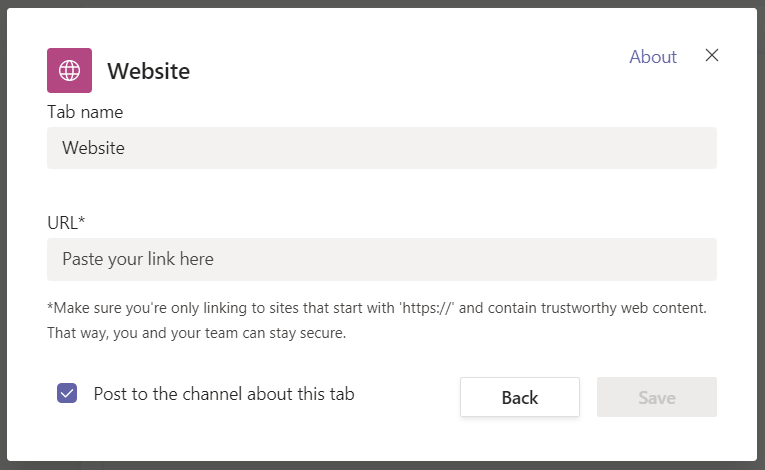
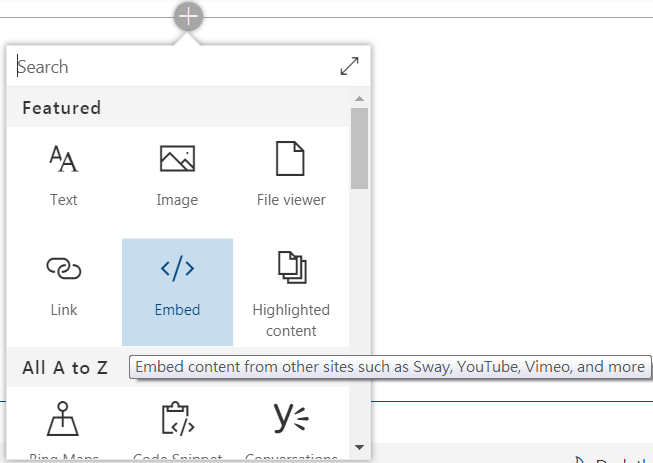
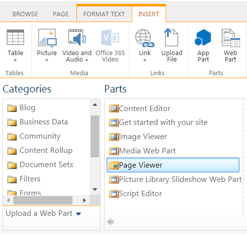

# Embed in Other Applications

You can integrate bimU.io with ohter applications by embedding. It is then possible to view your BIM model and data from other web-based applications if the following two common embedding methods are supported. Some usage examples are also provided below.

**_Note that sharing must be switched on to embed a bimU.io model._**

### Types of Embedding

- **IFrame:** An IFrame (Inline Frame) is an HTML (HyperText Markup Language) document embedded inside another HTML document on a website. The IFrame HTML element is often used to insert content from another source, such as a video, into a webpage.

- **Embed URL**: To have better control of how overall user interface looks like, some hosting applications might prefer a URL (Uniform Resource Locator) link to an external webpage rather than an IFrame. 
		
{: class="center" style="width:500px"}

Open the **Embed Options** from the three-dot menu. Both IFrame code and embed URL can be found in there.

### Embed in Microsoft Teams

Microsoft Teams is cloud-based team collaboration software that is part of the Office 365 suite of applications. The core capabilities include business messaging, calling, video meetings, file sharing, etc. It also supports embedding an external website within a tab in a channel.

{: class="center" style="width:500px"}

You can add a new tab by clicking the plus button and then select **Website** from various apps.

{: class="center" style="width:500px"}

Copy an **Embed URL** from a bimU.io model and paste it into the URL field shown in the above dialog. 

### Embed in Microsoft SharePoint

Microsoft SharePoint is a web-based collaborative platform that integrates with Microsoft Office. Organizations use SharePoint to create websites and manage documents. There two types of user interface: Classic and Modren. Classic SharePoint was a traditional look while Modern SharePoint is a whole new experience introduced to create responsive websites for different devices and screen sizes. Modern SharePoint exists only in SharePoint Online.

- **Modern SharePoint Page**

{: class="center" style="width:500px"}

Simply add an **Embed** web part in a Modern SharePoint Page and insert either **Embed URL** or **IFrame** code copied from a bimU.io model. You might need to ask your IT administrator to whitelist bimU.io URL if it is blocked.

- **Classic SharePoint Page**

{: class="center" style="width:500px"}

You can insert a **Page Viewer** web part in a Classic SharePoint Page. Then open the tool pane and paste an **Embed URL** copied from a bimU.io model in the Link text box. You might want to adjust a bit the layout and the appearance to make it look better. Also ask your IT administrator to whitelist bimU.io URL if it is blocked.

### Embed in Your Own Website

Most CMS (Content Management System) websites, such as WordPress, can embed an external webapge by different technologies. You might need a plugin for this, too. If you have access to the source code of a website, it is also possible to insert an IFrame directly into your own webpage. Please feel free to reach out by logging a support ticket if you come across any problem. 
