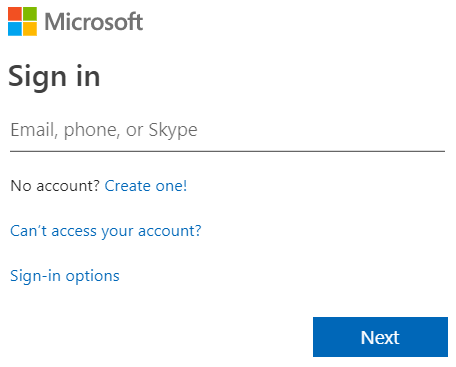
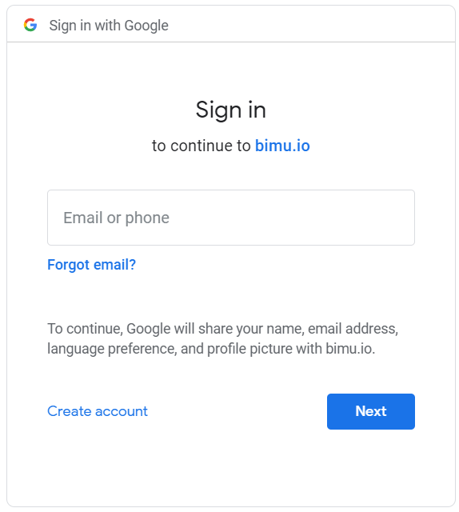

# Log in to bimU.io
We aim to make your life easier. You don't need to sign up a new account to use bimU.io. Instead, we provide two ways of authentication. Simply log in to bimU.io via Microsoft or Google. Both of them support Single Sign-On (SSO). You can use your personal, company, or school account to log in. See details of different account types below.

## Log in with Microsoft Account
{: class="center" style="width:300px"}

- **Organisational account:** This has to be an account set up by your company, school, or organisation via Microsoft Azure Active Directory (AAD). If you use Microsoft Office 365 or any Microsoft online service, your Microsoft account should be able to log in to bimU.io directly. However, this capability might be disabled by your IT administrator.
- **Personal account:** This is an account offered by Microsoft for personal use, such as yourname@outlook.com or yourname@hotmail.com. It could also be any email address. For example, you might use yourname@gmail.com to sign up a Microsoft account.

## Log in with Google Account
{: class="center" style="width:300px"}

* **G Suite account:** This has to be an account set up by your company, school, or organisation via Google G Suite. If you use Gmail, Google Docs, or any Google online service, your Google account should be able to log in to bimU.io directly. However, this capability might be disabled by your IT administrator. Note that a Google G Suite account must associate with a custom domain (e.g., yourname@mycompany.com) rather than using yourname@gmail.com. 
* **Gmail account:** This is an account offered by Google for personal use. It must be yourname@gmail.com.