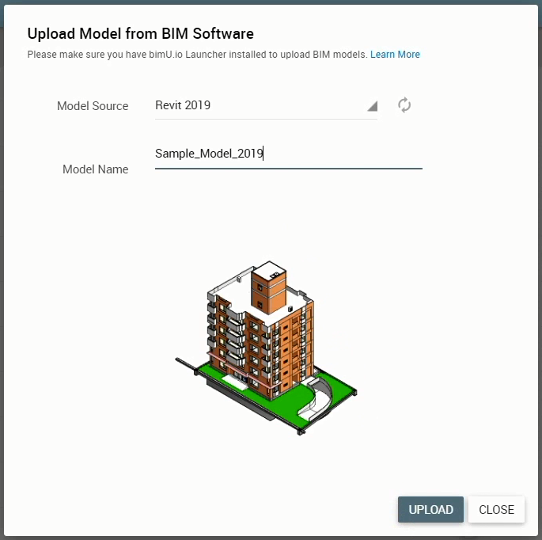
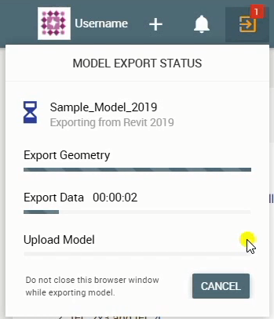

# Upload a BIM Model

There are two ways to upload your BIM models:

- **Upload from BIM Software:** Uploading from a BIM model view within authoring software gives you more control of how it looks like on bimU.io. What You See Is What You Get (WYSIWYG). Please follow the instructions in the next section to install the bimU.io Launcher before uploading a BIM model from authoring software.
- **Upload IFC files:** The industry standard IFC (Industry Foundation Classes) format is also supported. Most authoring software can export to an IFC file. You can then upload it to bimU.io directly. 

### Install bimU.io Launcher

!!! warning "Note that you must have bimU.io Launcher installed to upload a model from BIM software."

#### What is bimU.io Launcher?

bimU.io Launcher is a middleware that exchanges data between bimU.io and BIM software. It is a background process running along with BIM software without a user interface. Unlike other third-party tools that require a plugin opened manually within various BIM software for exporting data, bimU.io Launcher implements the so-called **Pluginless** technology which allows users to stick with a single user interface, i.e., using bimU.io via browser.

#### Supported BIM Software

- Autodesk Revit 2014-2020
- Autodesk Navisworks 2014-2020
- Trimble Tekla Structures 21.0-2019

#### Download Installer

**<a href="https://github.com/Transformosa/bimU.io.Launcher/releases/download/2019.10.14.0/bimU_io_Launcher_2019.10.14.0.exe" target="_blank">Download bimU.io Launcher 2019.10.14.0</a>**

!!! warning "Please close all BIM software sessions prior to installation."

The latest version of bimU.io Launcher is 2019.8.5.0. The installer can downloaded from the link above. Technically speaking, admin right is NOT required for the installation. Please speak to your IT staffs if you don't have permission to install it.

#### Automatic Update

bimU.io Launcher performs automatic update behind the scene for the installed components. However, you will need to download a new installer for a new version of BIM software. For example, bimU.io Launcher can update itself for Autodesk software 2014-2020 whenever bimU.io has a new release or a bug fixed. But a new installer will be required to support Autodesk software 2021 next year.

{: class="center" style="width:40%"}

You can check out the installed version fo bimU.io Launcher from the top menu bar. For an automatic update to take effect immediately, we suggest repeat the following steps **twice**: 

1. Restart your machine or log off Windows.

2. Make sure you have a stable internet connection.

3. Open any supported BIM software.

4. Open any file and wait for one minute.

#### Troubleshooting

If you have any problem installing or using bimU.io Launcher, please log a support ticket with the following two items attached if they exist:

- **Log File:** Open Windows File Explorer and paste `%localappdata%\temp\bimU.io.log` in the address bar. The log file is stored as `launcher.log` in the folder.
- **Error Code:** An error code, such as `No BIM software is currently opened. Error code: 1002`, would be shown in browser when something goes wrong on bimU.io.

### Upload from BIM Software

{: class="center" style="width:80%"}

Uploading from various BIM software has similar steps on bimU.io:

1. Open a 3D model view in any supported BIM software.

2. Make sure visisblity and appearance of model elements are as desired.

3. Click the plus button in the top menu bar and select **Upload from BIM Software**.

4. Select a **Model Source** (i.e., BIM software) where you want to upload from.

5. Review screenshot and click the **Refresh** icon button if you want to start over.

6. Change **Model Name** if you want a different one from current filename.

7. Click the **Upload** button to proceed.

Every BIM software handles 3D computer graphics differently. The general rules for bimU.io export are:

- Only visible model elements in the current 3D view are exported.
- Model unit is converted to meter.
- Materials are exported without textures.

See below for more details around how bimU.io exports a model from every BIM software. 

#### Export from Autodesk Revit

`2D View`, `Family Document` and `Analytical Model` are NOT supported for export at the moment. You must have a `3D View` opened to start the upload process. Visible `Linked Models` in the current `3D View` are exported, too.

Visisblity and appearance of `Elements` can be determined based on a number of factors, such as `Section Box`, `Visibility/Graphic Override`, `Temporary Hide/Isolate`, etc.

Both `Type Parameters` and `Instance Parameters` are exported. Some file metadata, such as `Document` properties, `Project Information`, `Project Position`, `Site Location`, etc. are exported, too. Model coordinates are converted to `Shared Coordinates`.

#### Export from Autodesk Navisworks

Appearance of `Model Items` can be determined by `Color and Transparency Override`. However, `Sectioning` is NOT currently supported. If you don't want to export some of the `Model Items`, you'll have to select and hide them manually.

Most of the `Properties` shown in the `Properties Window` are exported, including `Document`-level properties.

#### Export from Trimble Tekla Structures

Visible `Model Objects` in the active `Work Area` are exported. Color settings are defined by Tekla and cannot be changed.

The exported `Model Objects` include `Part`, `Assembly`, `Pour Object`, `Base Component`.

The exported properties include `Model Information`, `Project Information`, `User-Defined Attributes`, and the properties defined in the `Global Attributes`.

#### Export from Other BIM Software

bimU.io Launcher doesn't integrate with other BIM software at the moment. As a workaround, you can export to an IFC file from most BIM authoring software, such as Graphisoft ArchiCAD, Bentley OpeningBuildings Designer (formerly AECOsim Building Designer), etc.

#### Monitor Progress

{: class="center" style="width:40%"}

!!! warning "DO NOT close browser window before the upload is finished."

You can check out the progress from the top menu bar while a model is being exported and uploaded. You might cancel it if necessary.

### Upload an IFC File

Both IFC 2x3 and IFC 4 formats are supported. Uploading an IFC file is quite straightforward. Simply click the plus button in the top menu bar and select **Upload IFC File**. The upload process will start as soon as you select or drag and drop an IFC file in the dialog.

### Upload Other 3D File Formats

We aim to support more and more authoring software and 3D file formats in the future. The below items have been prioritised for developement. Note that the delivery timelines may change. Stay tuned on our our social media (<a href="#" target="_blank">Twitter</a>, <a href="#" target="_blank">Facebook</a>, <a href="#" target="_blank">YouTube</a>, <a href="#" target="_blank">Blog</a>) for the updates.

- **McNeel Rhinoceros 3D (.3dm):** January 2020
- **Trimble SketchUp (.skp):** March 2020

### Notifications

bimU.io will process your model immediately after upload. Depending on file size, it can often be done in minutes. When a model is ready to view, you will receive an email notification and also a browser notification if you have bimU.io opened.

### Current Limitations

To optimise computing and storage resources, bimU.io limits the size of a model that you can upload to **bimU.io Viewer Free**. Currently, the following soft limits apply per model file and will be increased for paid users in the near future. These should be sufficient for most use cases. 

- **Compressed upload file size:** 100 MB
- **Number of visible model elements:** 100,000
- **Uncompressed model geometry size:** 400 MB
- **IFC upload file size:** 150 MB