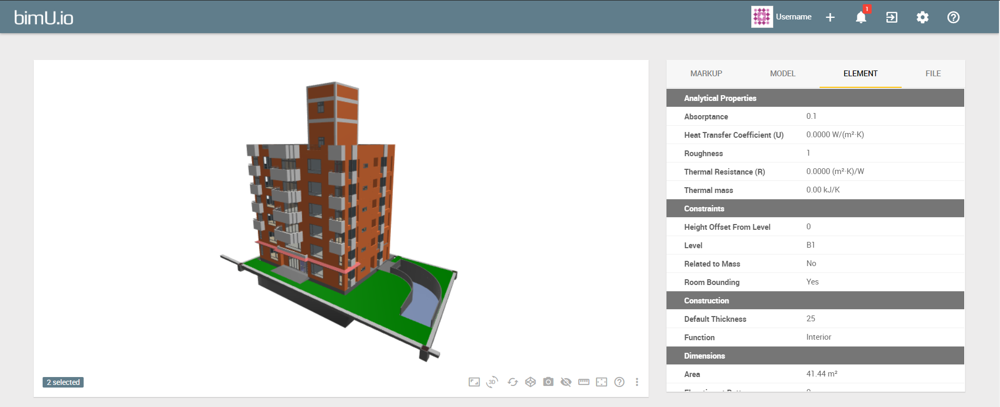
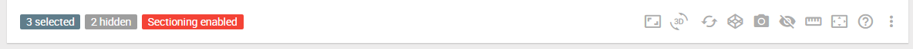
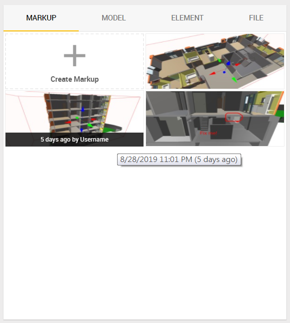
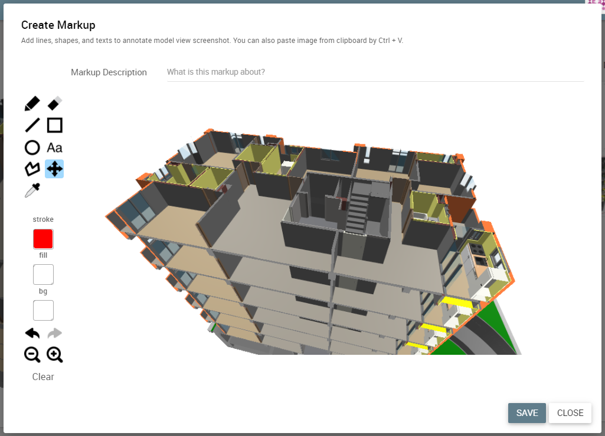
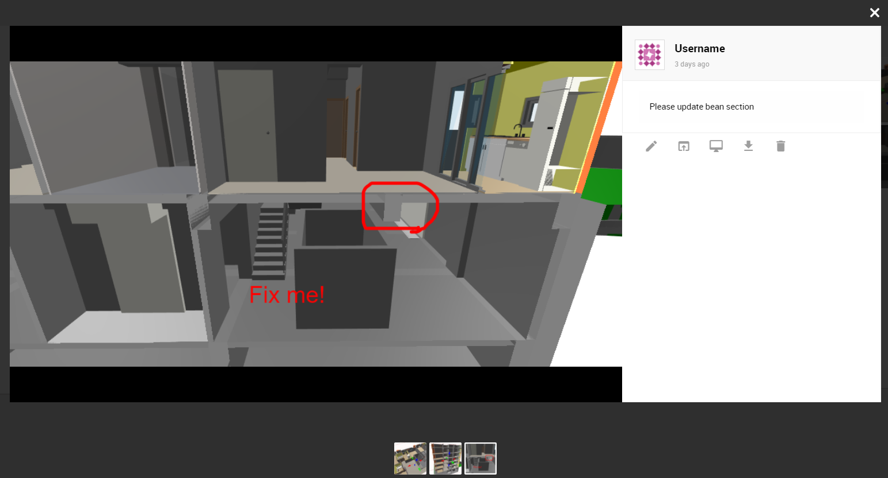
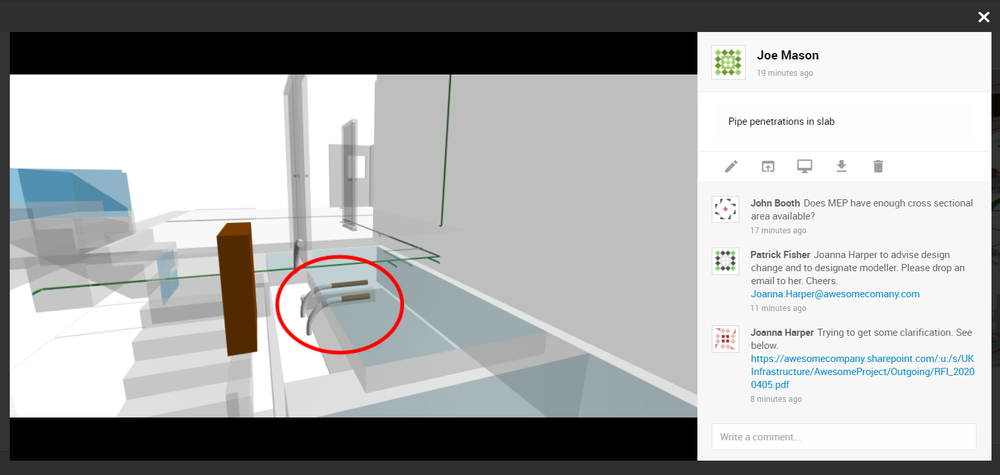

# Nagivate Using Web Model Viewer

Clicking the magnifier button or on a model name brings you to a web model viewer page. You can view your model in a 3D viewer along with BIM data and saved markups.

{: class="center" style="width:100%"}

### Use 3D Viewer

bimU.io's 3D viewer is web-based, which means that it is cross-platform and can be used on any device as long as you have a WebGL-enabled browser installed. We suggest use the latest version of **Google Chrome** to achieve the best performance.

{: class="center" style="width:100%"}

The viewer toolbar is located at the bottom of the 3D viewer. The status labels will be shown on the bottom left when you make changes, such as enabling sectiong, selecting elements, changing element visibility, etc.

#### Basic Viewer Controls

You can control the camera with the following tools to view the 3D scene from different perspectives.

- **Orbit:** The orbit tool allows you to rotate the camera around your model by using `left mouse drag` on desktop or `one finger swipe` on mobile devices. The camera will orbit around the centre of current selection or the previous zoom target. 
- **Pan:** The pan tool allows you to move the camera vertically or horizontally by using `right mouse drag` on desktop or `two-finger scroll` on mobile devices.
- **Zoom:** The zoom tool allows you to zoom in to focus on a specific area or zoom out to see more of your model by using `mouse wheel` on desktop or `two-finger pinch` on mobile devices. The zoom speed will decrease gradually as the camera gets closer to the zoom target.

#### Specfic Camera Viewpoints

 You can use the following tools to set camera viewpoint to specific areas you want to see.

- **Zoom to Fit:** This tool fits the entire model into the current viewport. It is particularly useful when you get lost in the 3D scene.
- **Zoom to Selection:** This tool fits the selected elements into the current viewport to focus on them. You can use this tool if a target is too far or too close to zoom. 
- **Set Viewpoint:** This tool sets the current camera viewpoint from/to BIM software. See more details [here](#open-viewpoint-in-bim-software).

!!! warning "You must have bimU.io Launcher installed to set a viewpoint from/to BIM software."

- **Rotate View:** This tool can view your model from all sides of the bounding box, including top, bottom, front, back, left, and right.

#### Section Cut

You can enable sectioning to slice your model to view more details inside. To disable sectioning, use the **Reset Visibility** tool.

- **Section Box:** This tool cuts model geometry by a rectangular box. The six edges of the section box can be adjusted using the grips.
- **Section around Selection:** This tool creates a section box around the selected elements. Then you can expand it to view the adjacent area.

#### Model Elements

- **Select Elements:** Use `left mouse click` to select a model element. `Shift + Left click` to select multiple elements.
- **Hide Elements:** This tool hides the selected elements. You can use the **Reset Visibility** tool to unhide them.

#### Other Viewer Capabilities

- **Reset Visibility:** This tool unhides all hidden elements and disables sectioning.
- **Measuring Tool:** A few different measurement tools are available, such as reporting coordinates, measuring distance, height, angle, area, etc.
- **Toogle Fullscreen:** This tool presents the entire viewport of the 3D viewer in browser's fullscreen mode.
- **Use Orthographic Camera:** This tool can switch the camera between perspective and orthographic projection.
- **Switch to Embedded Mode:** This tool enables the embedded mode which isolates the 3D viewer from the user interface. You can still view BIM data from the toolbar. It is particularly useful when the fullscreen mode is not supported, such as iOS devices.

### Work with Markups

{: class="center" style="width:60%"}

In bimU.io, a markup is more than an image with some sketches. In addition to adding lines, shapes, freehand drawings, texts, etc. to annotate a screenshot of model view, every markup can capture a camera viewpoint and include a short description. You can then navigate to this location in a model later by opening the viewpoint in the 3D viewer or other BIM software. The concept is similar to BIM Collaboration Format (BCF). 

!!! info "bimU.io Agile, our full-fledged BIM issue tracking solution, will also support BCF in late 2021."

#### Create a Markup

{: class="center" style="width:100%"}

Click the **Create Markup** placeholder in the **Markup Tab** and a dialog will pop up where you can find various drawing and annotation tools. If you want to paste an image taken from elsewhere, simply paste it from clipboard into the dialog by Ctrl + V. Add some description and Click **Save** when you are done. If your shared model is password-protected, guest users will be able to create markups, too.

#### View a Markup

{: class="center" style="width:100%"}

All markups attached to a model are shown in the **Markup Tab**. Click a thumbnail to enlarge it and view its details. You can also edit description, download image, or delete it in the lightbox.

#### Comment on a Markup

{: class="center" style="width:100%"}

Guest users are now able to create markups and leave comments within a password-protected BIM model without creating an account. Once your BIM model is shared via a password-protected link, whoever has the link and knows the password can also create markups or leave comments on markups.

#### Open Viewpoint in Web Viewer

A viewpoint attached to a markup can be opened directly in the 3D viewer. It would restore previous camera location, angle, sectioning state, etc.

#### Open Viewpoint in BIM Software

!!! warning "You must have bimU.io Launcher installed to open a viewpoint in BIM software."

Make sure bimU.io Launcher is running and connected to browser. Then you can open a saved viewpoint in any supported BIM software as long as a corresponding model file is also opened. More details around bimU.io Launcher can be found [here](/upload-a-bim-model#install-bimuio-launcher).

The latest version of bimU.io Launcher supports setting camera viewpoint from/to Solibri. Please make sure Solibri is opened with REST API enabled and bimU.io Launcher is running in the background. We've created a Windows program called **Start Solibri** that does everything needed to use this function. You can find it in the `Start Menu` -> `bimU.io` or `Transformosa` -> `Start Solibri`.
		
### View BIM Data

Uploaded BIM data normally consists of document information, element properties, and file metadata which can be viewed from the following three tabs. 

#### Model Tab

Model specific data refers to document-level information, such as project details, location, coordinate system, other authoring software metadata, etc.

#### Element Tab

Model element data includes all properties of a selected element. It can be a `Revit Parameter`, a `Navisworks Property`, a `Tekla Attribute`, or an IfcPropertySingleValue. 

#### File Tab

These are file properties specific to bimU.io, such as model source, file size, timestamp, etc.

### Mobile User Interface

A simplified user interface will be enabled on a mobile device if the screen size is too small. You can still view BIM data from the toolbar though some of the tools might be disabled. The main user interface might be available if you change device orientation to landscape mode and then refresh the entire page.